# EduSync Database Schema

## Entity Relationship Diagram

```mermaid
erDiagram
    roles {
        int role_id PK
        varchar role_name UK
    }
    
    users {
        int user_id PK
        varchar full_name
        varchar email UK
        varchar password_hash
        varchar phone
        int role_id FK
        varchar institution
        varchar location
        timestamp created_at
        timestamp updated_at
    }
    
    business_applications {
        int application_id PK
        int user_id FK
        varchar business_name
        varchar business_type
        text license_info
        varchar status
        timestamp applied_at
        timestamp reviewed_at
        text review_comments
    }
    
    businesses {
        int business_id PK
        int owner_id FK
        varchar business_name
        varchar business_type
        text description
        boolean is_verified
        timestamp created_at
        timestamp updated_at
    }
    
    business_products {
        int product_id PK
        int business_id FK
        varchar product_name
        text description
        decimal price
        int stock_quantity
        text terms_conditions
        boolean is_active
        timestamp created_at
        timestamp updated_at
    }
    
    business_orders {
        int order_id PK
        int user_id FK
        int business_id FK
        timestamp order_date
        varchar payment_method
        varchar status
        timestamp created_at
    }
    
    business_order_items {
        int order_item_id PK
        int order_id FK
        int product_id FK
        int quantity
    }
    
    categories {
        int category_id PK
        varchar category_name UK
    }
    
    secondhand_items {
        int item_id PK
        int seller_id FK
        int category_id FK
        varchar item_name
        text description
        decimal price
        varchar condition
        text terms_conditions
        timestamp posted_at
        boolean is_active
    }
    
    secondhand_orders {
        int order_id PK
        int buyer_id FK
        int item_id FK
        timestamp order_date
        varchar status
    }
    
    rental_products {
        int rental_id PK
        int owner_id FK
        int category_id FK
        varchar product_name
        text description
        decimal rent_per_day
        date available_from
        text terms_conditions
        boolean is_active
    }
    
    rental_orders {
        int rental_order_id PK
        int renter_id FK
        int rental_id FK
        date start_date
        date end_date
        varchar status
        timestamp created_at
    }
    
    food_vendors {
        int vendor_id PK
        int user_id FK
        varchar shop_name
        text description
        boolean is_verified
        timestamp applied_at
        timestamp verified_at
    }
    
    food_items {
        int food_item_id PK
        int vendor_id FK
        varchar item_name
        text description
        decimal price
        boolean is_active
        timestamp created_at
        timestamp updated_at
    }
    
    food_item_images {
        int image_id PK
        int food_item_id FK
        text image_url
    }
    
    food_orders {
        int order_id PK
        int user_id FK
        int vendor_id FK
        date order_date
        timestamp order_placed_at
        varchar status
    }
    
    food_order_items {
        int order_item_id PK
        int order_id FK
        int food_item_id FK
        int quantity
    }
    
    payments {
        int payment_id PK
        int buyer_id FK
        int seller_id FK
        int product_id FK
        decimal amount
        varchar payment_method
        decimal platform_fee
        varchar status
        varchar transaction_reference
        timestamp created_at
    }
    
    wallets {
        int wallet_id PK
        int user_id FK
        decimal balance
        timestamp created_at
        timestamp updated_at
    }
    
    transactions {
        int transaction_id PK
        int wallet_id FK
        decimal amount
        varchar transaction_type
        varchar status
        text description
        timestamp created_at
    }
    
    lost_found_items {
        int item_id PK
        int user_id FK
        varchar item_type
        varchar title
        text description
        varchar location
        varchar contact_info
        boolean is_claimed
        timestamp created_at
    }
    
    notices {
        int notice_id PK
        int posted_by FK
        varchar title
        text content
        varchar category
        boolean is_pinned
        timestamp created_at
    }

    %% Relationships
    roles ||--o{ users : "has"
    users ||--o{ business_applications : "submits"
    users ||--o{ businesses : "owns"
    users ||--o{ business_orders : "places"
    users ||--o{ secondhand_items : "sells"
    users ||--o{ secondhand_orders : "buys"
    users ||--o{ rental_products : "owns"
    users ||--o{ rental_orders : "rents"
    users ||--o{ food_vendors : "operates"
    users ||--o{ food_orders : "orders"
    users ||--o{ payments : "buys_from"
    users ||--o{ payments : "sells_to"
    users ||--|| wallets : "has"
    users ||--o{ lost_found_items : "posts"
    users ||--o{ notices : "creates"
    
    businesses ||--o{ business_products : "sells"
    businesses ||--o{ business_orders : "receives"
    
    business_products ||--o{ business_order_items : "includes"
    business_products ||--o{ payments : "for"
    
    business_orders ||--o{ business_order_items : "contains"
    
    categories ||--o{ secondhand_items : "categorizes"
    categories ||--o{ rental_products : "categorizes"
    
    secondhand_items ||--o{ secondhand_orders : "ordered"
    
    rental_products ||--o{ rental_orders : "rented"
    
    food_vendors ||--o{ food_items : "offers"
    food_vendors ||--o{ food_orders : "receives"
    
    food_items ||--o{ food_item_images : "has"
    food_items ||--o{ food_order_items : "includes"
    
    food_orders ||--o{ food_order_items : "contains"
    
    wallets ||--o{ transactions : "has"
```

## Key Features

### 1. User Management & Roles
- **Roles**: Different user types (student, vendor, admin, etc.)
- **Users**: Complete user profiles with institution and location
- **Authentication**: Secure password hashing and email verification

### 2. Business Marketplace
- **Business Applications**: Vendor verification process
- **Businesses**: Verified small business shops
- **Business Products**: Product catalog with inventory management
- **Business Orders**: Order management system

### 3. Second-hand Marketplace
- **Secondhand Items**: Peer-to-peer selling platform
- **Categories**: Item categorization system
- **Secondhand Orders**: Purchase management

### 4. Rental System
- **Rental Products**: Equipment and item rental
- **Rental Orders**: Booking system with date ranges

### 5. Food Delivery System
- **Food Vendors**: Restaurant/canteen management
- **Food Items**: Menu management with images
- **Food Orders**: Order system with date-based ordering

### 6. Payment & Wallet System
- **Payments**: Transaction processing
- **Wallets**: User digital wallets
- **Transactions**: Complete transaction history

### 7. Community Features
- **Lost & Found**: Item recovery system
- **Notices**: Campus announcements and notifications

## Security & Business Rules

1. **Financial Constraints**: All prices and amounts have check constraints
2. **Stock Management**: Stock quantities cannot be negative
3. **Date Validation**: Food orders limited to 7 days in advance
4. **Referential Integrity**: Cascading deletes for order items
5. **Unique Constraints**: Prevent duplicate roles and categories
